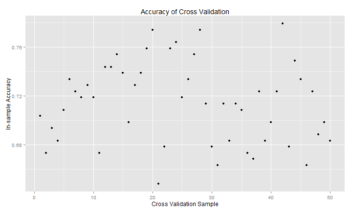

Predicting Exercise Manner from Accelerometer Readings
========================================================

### Executive Summary
This analysis examines the dataset mtcars tp determine the relationship between MPG (miles per gallon) and transmission type (automatic or manual).  It concludes there is no strong relationship between mpg and transmission when other more predictive variables are considered.  Weight, horsepower, and number of cylinders together in a linear model can explain 84% of the variation in mpg.  Adding transmission type to the analysis does not generate addiotnal insight.


### Exploratory Analysis

The training data consists of 19,622 cases of volunteer exercise action.  For each case there are 160 different measurements.  103 of the these variables are either missing or NA for over 95% of the cases.  The test data consists of 20 cases with the same variables and same missing or NA fields.

The first step after loading the data, was to remove the sparce variables from the dataframes which were used for the rest of the analysis.  It is possible that including these variables might have improved the prediction capabilites, but unlikely since none of these fields had values in the test data.  Because the random forest models take substantial time to run, parsimonious use of data variables is important.


```r
library(caret)
```

```
## Loading required package: lattice
## Loading required package: ggplot2
```

```r
library(AppliedPredictiveModeling)
library(ggplot2)
setInternet2(TRUE)

# Load in full training and testing data sets from course website
temp <- "https://d396qusza40orc.cloudfront.net/predmachlearn/pml-testing.csv"
full_test <- read.table(temp, sep = ",", header = TRUE)
temp <- "https://d396qusza40orc.cloudfront.net/predmachlearn/pml-training.csv"
full_train <- read.table(temp, sep = ",", header = TRUE)


# Remove all non-complete variable columns
test <- full_test[-c(1:7, 12:36, 50:59, 69:83, 87:101, 103:112, 125:139, 141:150)]
train <- full_train[-c(1:7, 12:36, 50:59, 69:83, 87:101, 103:112, 125:139, 141:150)]
colnames(test) <- colnames(train)
```


Initially, I had planned to run a random forest algorithm on the entire narrowed (19,622 x 53) data set.  However, the random forest algorithm proved too memory intensive.  An early version ran all night and still did not complete the training portion.  Therefore, a different approach was necessary.

Instead of running a random forest on the entire 19,622 cases in the training data, 50 different training instances were run on much smaller randomly generated samples.  Ultimately to complete the random forest algorithms in about 1 hour, each random sample was made 1% of the total test size (196 cases).  While this seems like a very small sample size and does increase the in-sample error of any one specific small sample, a weighted voting scheme among the 50 small samples seems to have effectively compensated from the small size.  The accuracy of the overall model is discussed further in the results section.

The strategy for training and cross validating the data is as follows.

 * First, 50 randomly generated samples of 196 cases were used to train a random forest predictors algorithms.
 * Second, the 50 random forest predictors algorithms were used to generate 196 predictions in randomly chosen cross validation sets.
 * Third, the accuracy of these cross validation sets was assigned as a weighting for each predictor algorithm.  Algorithms with higher accuracy received higher weightings for the voting stage of the process.
 * Forth, weighted voting of the 50 algorithms was conducted to present a single prediction for each test case.


```r
# Generate 50 micro training samples based on 1% of the training data This
# is because larger training files are taking too long to process Conduct a
# ramdom forest model on each of these 50 samples Because these training
# samples are so small we need many of them We generate predictions for 50
# cross validation samples to determine accuracy These accuracy values are
# used to weight the 50 training models
weight = rep(0, 50)
test_predict <- data.frame(matrix(rep(0, 100), nrow = 20, ncol = 50))
for (i in 1:50) {
    shortIndex = createDataPartition(train$classe, p = 0.01, list = FALSE)
    short_train <- train[shortIndex, ]
    shortIndex = createDataPartition(train$classe, p = 0.01, list = FALSE)
    short_cross <- train[shortIndex, ]
    
    modelFit <- train(classe ~ ., method = "rf", prox = TRUE, data = short_train)
    short_predict <- predict(modelFit, newdata = short_cross)
    t1 <- table(short_cross$classe == short_predict)
    weight[i] <- t1[2]/(t1[1] + t1[2])
    
    test_predict[, i] <- predict(modelFit, newdata = test)
}
```

```
## Loading required package: randomForest
## randomForest 4.6-7
## Type rfNews() to see new features/changes/bug fixes.
```


### Results


```r
# Plot accuracy precentage (in sample error) for each cross validation
# sample
qplot(1:50, weight, ylab = "In-sample Accuracy", xlab = "Cross Validation Sample", 
    main = "Accuracy of Cross Validation")
```

 


The plot above shows the cross validation accuracy for each of the 50 small samples.  Obviously, the small sample size leads to a large variation in accuracy.  This is expected because each training is occurring on only 196 cases.  

Ultimately, the final model was run three times and in all three instances the in-sample errors were consistently 60% to 80%.  All three plots showed a similar distribution of accuracies.  Based on weighting the more accurate sample higher, overall testing accuracy was expected to be above 75%, but below 85%.


```r
# Conduct weighted voting of the predictions made by the 50 models Aggregate
# the votes and present a single prediction for each test case sample
classe_letter <- c("A", "B", "C", "D", "E")
letter_results <- rep("Z", 20)
for (i in 1:20) {
    count <- c(0, 0, 0, 0, 0)
    for (j in 1:50) {
        if (as.character(test_predict[i, j]) == "A") {
            count[1] <- count[1] + weight[j]
        }
        if (as.character(test_predict[i, j]) == "B") {
            count[2] <- count[2] + weight[j]
        }
        if (as.character(test_predict[i, j]) == "C") {
            count[3] <- count[3] + weight[j]
        }
        if (as.character(test_predict[i, j]) == "D") {
            count[4] <- count[4] + weight[j]
        }
        if (as.character(test_predict[i, j]) == "E") {
            count[5] <- count[5] + weight[j]
        }
    }
    letter_results[i] <- classe_letter[order(count)[5]]
}
answer = rbind(letter_results, 1:20)
answer
```

```
##                [,1] [,2] [,3] [,4] [,5] [,6] [,7] [,8] [,9] [,10] [,11]
## letter_results "C"  "A"  "A"  "A"  "A"  "E"  "D"  "D"  "A"  "A"   "A"  
##                "1"  "2"  "3"  "4"  "5"  "6"  "7"  "8"  "9"  "10"  "11" 
##                [,12] [,13] [,14] [,15] [,16] [,17] [,18] [,19] [,20]
## letter_results "C"   "B"   "A"   "E"   "E"   "A"   "B"   "A"   "B"  
##                "12"  "13"  "14"  "15"  "16"  "17"  "18"  "19"  "20"
```


The predictions for the 20 test cases are shown above.

Despite the small sample size, the approach yields fairly good and fairly consistent predictions.  For the 20 test cases, the process accurately predicted 16 out of 20 cases.  In one of the incorrect predictions the first and second set of 50 samples disagreed, and I chose one with the higher accuracy which turned out to be incorrect.  The second prediction was the correct one.

The other 3 incorrect predicitons are interesting.  Two separate runs of 50 samples produced the same wrong 3 preditions and same wrong ordering of likely classification.  Because neither the first or second voting choices were correct it is possible the model was incapable of correctly classifying these cases, even if more data was used.  At some point in the future, when I don't need my computer for a couple of days, I want to try running the process with much larger samples and seeing if anything changes.  It is also possible that including the variables with partial data might improve the accuracy, but re-inserting them would slow the process exponentially.  Finally, although random forest are a great algorithm for classification, they are not perfect and a hybrid approach with other methods might be required if accuracy of 90% or greater is required.

